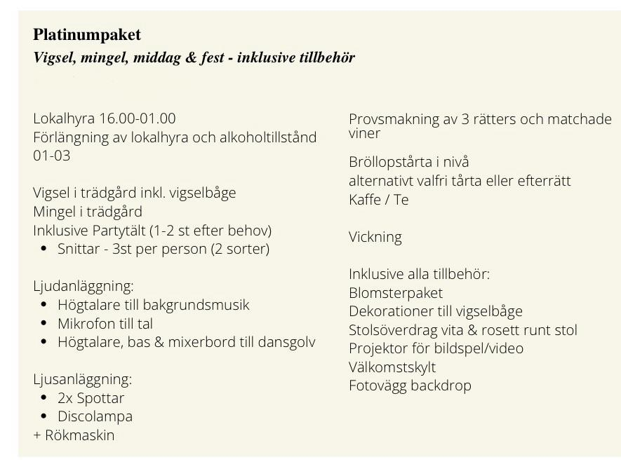
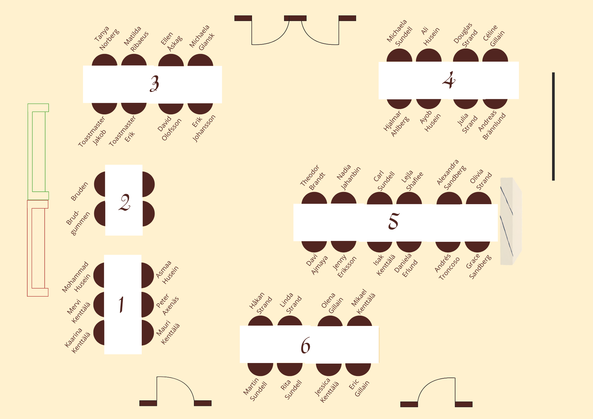

# Alina & Mustafa

## Körschema för dagen

| Tid   | Aktivitet |
|-------|-----------|
| 14:45 | 📍 Ankomst till Lyran |
| 15:00 | 📸 Möt upp fotograf och ta parbilder |
| 16:00 | 🤝 Mustafa och Alina möter vigselförrättaren — 🪪 vi legitimerar oss och visar vigselförrättaren våra vittnen |
| 16:30 | 💍 Vigsel |
| 16:45 | 🥂 Mingel i trädgården — Mustafa och Alina firar med gästerna |
| 16:50 | 🎵 Toastmasters sätter på spellistan "Mingel bröllop" |
| 18:10 | 🚪 Gästerna börjar gå in |
| 18:25 | 🍷 Presentation av menyn, dryck serveras |
| 18:40 | 🥗 Förrätt |
| 19:10 | 📸 Fotopaus — Alina och Mustafa går iväg och fotar |
| 19:30 | 🍽️ Varmrätt — 🎤 lekar och tal |
| 20:30 | 📸 Ev. fotopaus 2 — Alina och Mustafa går iväg och fotar |
| 20:50 | 🎂 Kaffe och tårta — Alina och Mustafa skär tårtan, 🎤 toastmaster informerar om tornet och fotobås |
| 21:30 | 💃 Första dansen — Alina och Mustafa dansar själva 1 minut, sedan joinar toastmasters |
| 21:50 | 🎉 Dansgolvet öppnar — öppna fotobås 📸 + tornet, Lyran + dansgolv |
| 23:00 | 🍕 Vickning |
| 03:00 | 🌙 Kvällen är slut |

## Att göra – innan bröllopsdagen

- Meddela Josefin:
  - Hur länge vigseln kommer pågå, dvs när minglet börjar
  - Körschema
  - Gästlista med allergier + be om alternativ meny
  - Kontaktinformation till Jakob och Erik
  - Antal bord och bordsplacering
  - Designa bordsplacering och be dem skriva ut
  - Blommor och färgtema: skicka med exempelbilder och färgkoder
  - Frågor: Går det att få en annan färg på tårtan? Kommer ni lägga ut bordsplaceringskorten?
- Gå igenom punkter från vigselförrättare och meddela hur vi vill göra
- Välja dikt till vigsel
- Boka möte med toastmasters
- ~~Boka hotell~~
- Boka möte med bröllopsfotograf
- Lämna in kostym för skräddning
- Skapa bordsplacering
- ~~Beställa bröllopsris~~
- Beställa bordsplaceringskort
- Välja musik att gå ut till, efter vigsel och första dansen
- Boka danskurs?
- DJ?
- Beställa kameror + film
- Betala sista fakturan till Lyran (senast 12/8)
- Inhandla toalettartiklar: hårspray, munspray, alvedon, ipren, spraydeo osv.
- Beskrivning av gäster att lägga på borden

## Att göra – under bröllopsdagen (övrigt)

- Lägga ut bröllopsris på bänkar och stolar i trädgården innan vigsel (senast 16:00) – Tanya
- Ge bordsplaceringskort till personalen som ska duka
- Hålla kontakt med fotografen Ellinor och informera om viktiga familjemedlemmar etc. (möta henne 16:00) – Mervi eller Michaela
- Se till att Mustafas närmaste familj sätter sig längst fram till höger och Alinas närmaste familj får platserna längst fram till vänster
- Ställa ut två korgar med toalettkit vid toaletterna
- Hålla koll på vigselringar
- Hålla koll på Alinas väska (läppbalsam, ögondroppar, extralinser, makeup, legitimation osv.)
- Ge Alina buketten på vägen ut

## Att göra – under bröllopsdagen (toastmasters)

- Visa gäster till trädgården
- Påminna gäster om att stänga av sina mobiltelefoner innan vigseln (foto ej tillåten utöver fotografen)
- Hålla kontakt med Josefin innan vigsel för att signalera när Alina kommer att gå ut och sätta igång låten som Alina går ut till
- Sätta igång låten när Alina och Mustafa går ut efter vigsel
- Välkomna in gästerna till middagen när det är dags
- Ha koll på eventuella lekar/tal
- Annonsera första dansen och sätta på musik — låta Alina och Mustafa dansa själva 1 minut, sedan joina dansen
- Informera om att fotobås och tornet öppnar (vid kaffe och tårta)
- Testa ljudsystemet
- Veta var alla ska stå under vigseln

## Övrig information till toastmasters (+önskemål)

- Alina kommer att gå ned och möta Mustafa vid altaret
- I lokalen finns projektor, sladdlösa mikrofoner och ljudsystem som kopplas med Bluetooth
- Vi har tillgång till Lyrans övervåning från kl. 15.00
- Kontaktinformation Lyran: josefin@konditorilyran.se

## Lyran bistår med

- Serveringspersonal
- Trerätters och alkohol
- Dukar, servis, servetter och blommor
- Städning
- Välkomstskylt och bordsplaceringsskylt i guld
- Fotovägg (utan kamera)
- Projektor, sladdlösa mikrofoner och ljudsystem som kopplas med Bluetooth

## Bordsplacering

## Körschema Alina (bröllopsdagen)

| Tid   | Aktivitet |
|-------|-----------|
| 09:00 | Gå upp |
| 09:30 | Frukost |
| 11:00 | Hår |
| 13:00 | Smink |
| 13:30 | Lunch |
| 14:00 | Beställa taxi och gå igenom checklista |
| 14:45 | Ankomst till Lyran |

## Checklista Alina

- Brudklänning
- Slöja
- Brudskor
- Ballerinaskor
- Vigselring
- Legitimation
- En extra klänning?
- Väskan med extralinser, smink, tights osv.
- Steamer
- Laddare
- Talkort
- Packad övernattningsväska med linser och tandborstar
